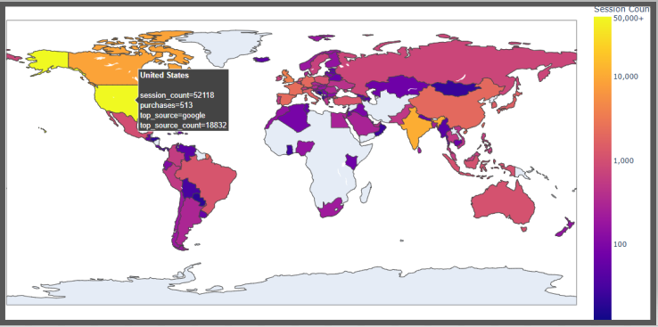

# E-commerce_Conversion_Funnel-BigQuery-Google_Colab_Project 🚀
 
Welcome to BigQuery and Google Colab Project!

## Gallery and Insights 📊🔎

### 1. Sessions and Purchases Distribution by Country. 

With over 52,000 sessions, the USA significantly outperforms all other countries. Engagement across the African continent remains minimal. Google serves as the primary traffic source for the majority of countries.

### 2. Sessions Distribution by Source/Medium.

Traffic from unpaid search results on Google lead with more than 37000 sessions. Traffic from users who typed your URL directly where the medium is not explicitly defined takes second place.

### 3. CR by Event and Device Category.

CR from session_start to add_to_cart( ~3.9%) is below the market average (5%). Conversions across all device categories are at the same level.

### 4. CR by Event and Source.

Conversion rate across source (data deleted) is higher than others.

